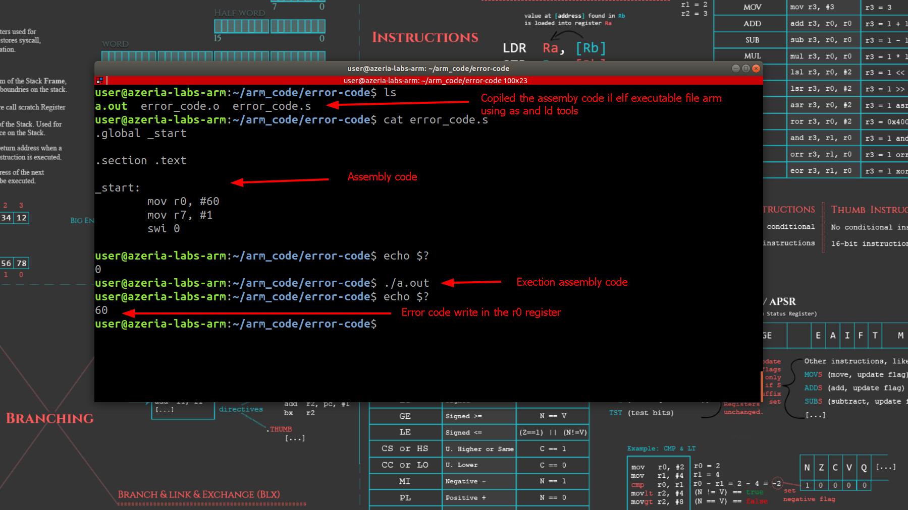

# Introduction
This code is an example of error code exception write in ARM assembly. To achive that we need to set the error number in **r0** register, set the value **1** in **r7** register to call the syscall **int error_code**, [reference here](https://chromium.googlesource.com/chromiumos/docs/+/master/constants/syscalls.md#arm-32_bit_EABI). 

## Execution
